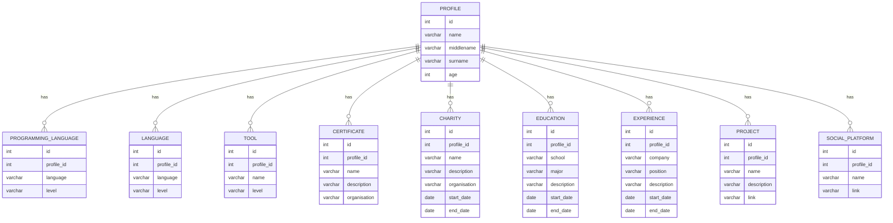

<h1 align="center">

</h1> 

__*AI agents that create tailored CVs and cover letters, and even apply to jobs for you. Fully automated — no more manual effort*__
 

# Database schema

```mermaid
erDiagram
    PROFILE {
        int id
        varchar name
        varchar middlename
        varchar surname
        int age
    }
    PROGRAMMING_LANGUAGE {
        int id
        int profile_id
        varchar language
        varchar level
    }
    LANGUAGE {
        int id
        int profile_id
        varchar language
        varchar level
    }
    TOOL {
        int id
        int profile_id
        varchar name
        varchar level
    }
    CERTIFICATE {
        int id
        int profile_id
        varchar name
        varchar description
        varchar organisation
    }
    CHARITY {
        int id
        int profile_id
        varchar name
        varchar description
        varchar organisation
        date start_date
        date end_date
    }
    EDUCATION {
        int id
        int profile_id
        varchar school
        varchar major
        varchar description
        date start_date
        date end_date
    }
    EXPERIENCE {
        int id
        int profile_id
        varchar company
        varchar position
        varchar description
        date start_date
        date end_date
    }
    PROJECT {
        int id
        int profile_id
        varchar name
        varchar description
        varchar link
    }
    SOCIAL_PLATFORM {
        int id
        int profile_id
        varchar name
        varchar link
    }

    PROFILE ||--o{ PROGRAMMING_LANGUAGE : has
    PROFILE ||--o{ LANGUAGE : has
    PROFILE ||--o{ TOOL : has
    PROFILE ||--o{ CERTIFICATE : has
    PROFILE ||--o{ CHARITY : has
    PROFILE ||--o{ EDUCATION : has
    PROFILE ||--o{ EXPERIENCE : has
    PROFILE ||--o{ PROJECT : has
    PROFILE ||--o{ SOCIAL_PLATFORM : has
```
